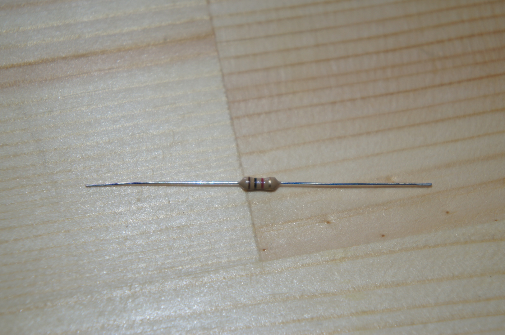

#手作り抵抗

##準備するもの
1. ダンボールのきれはし
1. えんぴつ（４Ｂ）
1. テスター
1. ブレッドボード
1. 単３乾電池（２本）
1. 電池ケース（２本用）
1. LED（なんでも）
1. ミノムシクリップ
1. カーボン抵抗（なんでも）
1. 配線用ジャンパ線

##抵抗器(抵抗)って？
抵抗器は、電気を流れにくくする電子部品です。
流れる電気の量を調整して、電子回路を適正に動作させる役割を持つ大切な部品です。

##抵抗器のしくみ
抵抗器は、電気を流れにくくする材料でできています。

電気が流れにくい、ということは、電気の通り道に障害物があるイメージで、これを抵抗体といいます。単位体積あたりの電気の流れにくさを抵抗率であらわします。

抵抗率の低い材料に電気を流すとスムーズに流れますが、抵抗率の高い材料に電気を流すと電気は障害物によって流れを妨げられます。電気が障害物に衝突すると熱を発します。

電気の流れやすさは、材料の長さに比例し、断面積の大きさに反比例します。

##抵抗器の記号と単位
| 記号 | 単位 |
| -- | -- |
| Ｒ | Ω(オーム) |
電子工作では、抵抗値の大きなものから小さなものまで幅広く抵抗値を使うので、Ω（オーム）の1,000倍にあたるｋΩ（キロオーム）や、1,000,000倍にあたるＭΩ（メガオーム）も出てきます。

抵抗器の抵抗値は文字のかわりに色の帯であらわします。

| 色 | 数値 |
| -- | -- |
| 黒 | 0 |
| 茶 | 1 |
| 赤 | 2 |
| 橙 | 3 |
| 黄 | 4 |
| 緑 | 5 |
| 青 | 6 |
| 紫 | 7 |
| 灰 | 8 |
| 白 | 9 |
| 金 | 5% |
| 銀 | 10% |

* 第１、第２色帯・・・数値
* 第３色帯・・・・・・１０を掛け算する回数
* 第４色帯・・・・・・誤差
* 単位はΩ

例えば、「茶黒赤金」であれば、
* 茶・・・１
* 黒・・・０
* 赤・・・１０を２回かける
* 金・・・誤差５％

１０✕１０✕１０＝１，０００Ω＝１ｋΩ

となります。

##抵抗器をつくる
今回は、１０ｋΩの抵抗値をもったものを作ってみます。

抵抗器の材料は、ダンボールと4Bのえんぴつです。

ダンボールを、長さ5cm、幅を2cmに切り、えんぴつで黒く塗りつぶします。
