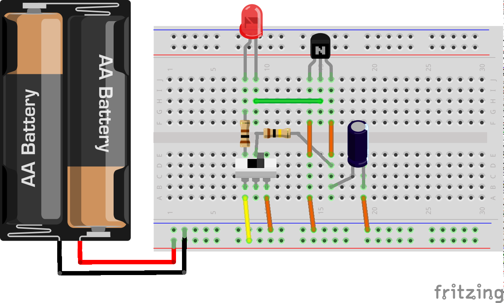
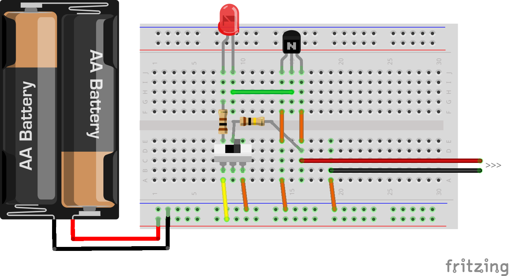

#手作りコンデンサ

##コンデンサって？

コンデンサは電気を蓄えたり放出したりする電子部品です。
電子回路では必ず使うと言って良いほど、電子機器に欠かせない部品です。
電圧を安定させたり、ノイズを取り除いたり、信号を取り出したり、といったはたらきがあります。

##コンデンサのしくみ

コンデンサは基本的に、２枚の金属板を絶縁体ではさんだかたちになっています。

金属板に電圧をかけると、絶縁体をはさんでプラスとマイナスの電気がお互いを磁石のように引っ張り合います。電圧をかけるのをやめても金属板に引っ張り合うちからは残ります。このようにして金属板に電気をためこみます。

ためこめる電気の量を静電容量といい、金属板が大きいほど、２枚の金属板の間隔が小さいほど、容量はおおきくなります。
また、電気を蓄えるのを助ける能力を誘電率といいます。この能力の高い絶縁体（誘電体）にすることでも静電容量は大きくなります。

金属板と、絶縁体となる素材や、かたちによって、様々な種類のコンデンサがあります。

##コンデンサのはたらき

コンデンサの電気をためるはたらきを実際にみてみます。
次の図のように、ブレッドボード上に回路を組みましょう。

このとき、コンデンサとLED、電源のプラスとマイナスの向きに気をつけてください。

コンデンサについている白い帯のほうにある線がマイナスになります。または、線の長い方がプラスです。
LEDは線の長いほうがプラスです。

この回路は、スイッチを入れるとLEDが「じわ〜っと」光ります。スイッチを切ると「じわ〜っと」消えていきます。
この、「じわ〜っと」させる効果がコンデンサのはたらきのひとつです。

試しに、コンデンサを外してから、スイッチを入／切してみてください。
じわ〜っとせずに、ハッキリと、点灯・消灯するようになります。

##コンデンサをつくる

ここから、自分でコンデンサをつくってみます。

２枚の金属板は、アルミ板。絶縁体は、ホウ砂を溶かした水（お湯）でつくります。
ホウ砂が溶けた水とアルミ板によって、電解コンデンサのようなしくみになります。

なお、ホウ砂は大量に摂取すると体に害を与えますので、取り扱いに十分注意してください。

２００ｍｌのコップにホウ砂の量は１０ｇ程度にします。
よくかき混ぜて溶かしたら、２枚のアルミ板をワニ口クリップではさみます。

もう片方のワニ口クリップを、先ほどのブレッドボード上で組んだ回路のコンデンサの替わりに接続します。

製品のコンデンサほどではありませんが、「じわっと」ついたり消えたりすれば成功です。
