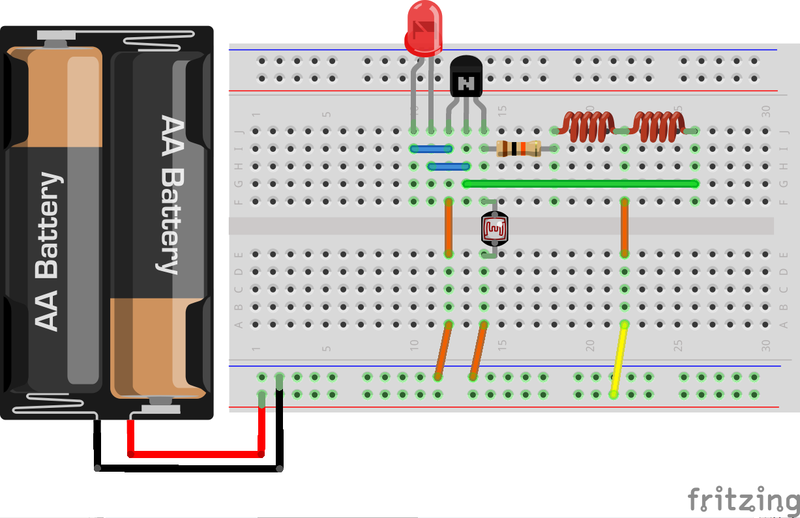

#手作り部品組合せ

##コイルの組合せ回路
手作りコイルで作った回路では、スイッチを押して放した瞬間にピカっと光りました。スイッチをずっと連射すると、ピカピカと点滅していく様子がわかります。

それでは、この点滅の間隔がどんどん短くなるとどうなるでしょうか？
次の図のように回路を組んで、とてもとても短い間隔で点滅を繰り返すようにしてみます。

※図では乾電池２本になっていますが、実際には１本です。

LEDはずっと付きっぱなしになっているように見えます。
これは人間の目で認識できないほど早い間隔で点滅を繰り返すと、ずっと点灯しているように見える現象です。

では、本当に点滅しているのでしょうか？
オシロスコープという計測器を使うと、実際に流れる電気を測ることができます。

LEDに流れる電圧をオシロスコープで計測すると、次のように波形にして見ることができます。

上のグラフは、x軸が電圧でひとマス1V、y軸が時間でひとマス1us(マイクロセカンド=100万分の1秒)です。
グラフの山の部分で点灯、谷の部分で消灯して、非常に早い間隔で点滅を繰り返していることがわかります。

この波形のような状態を「発振」といい、電子回路では様々な場面で使われます。

ちなみに、この回路は「ジュールシーフ」といわれています。
使い古しの乾電池でも効率よく電気（電圧）を取り出してLEDを光らせることができます。

次の図のように、光センサー（CDSセル）を入れると、暗くなったら光るLEDライトになります。

